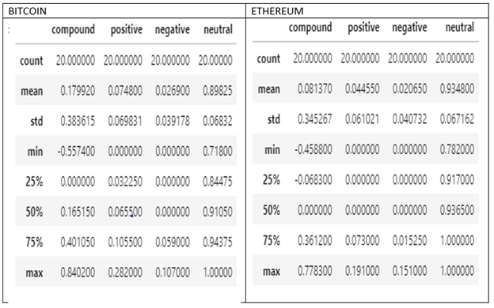

# NLP_Homework

Brief Summary of Activity

In this assignment, the natural language processing was applied to understand the sentiment in the latest news articles featuring Bitcoin and Ethereum. The fundamental NLP techniques was also employed to better understand the other factors involved with the coin prices such as common words and phrases and organizations and entities mentioned in the articles.

The first part of the exercise began with Sentiment Analysis task. Here, the required libraries were imported and the api key was used to read the environment variable. The Newsapi was used to fetch various articles for Bitcoin and Ethereum respectively after which a sentiment score DataFrame was created.

See below the description of the sentiments.

 
Here, the following questions were answered:

Which coin had the highest mean positive score? Bitcoin had the highest mean positive score.

Which coin had the highest compound score? Bitcoin had the highest compound score.

Which coin had the highest positive score? Bitcoin had the highest positive score.

The second part involved a task on Natural Language Processing. Here, NLTK and Python were used to tokenize the text for each coin. Each word was changed to lowercase, punctuation as well as stopwords were removed and a new token column was created for both Bitcoin and Ethereum. In addition, the N-grams, word frequency and word clouds were generated to summarize the news for each coin.

See below a snapshot of the word cloud for both coins

 
The final task was on Named Entity Recognition, and it was visualized using SpaCY. Below is a snapshot for Bitcoin

 
